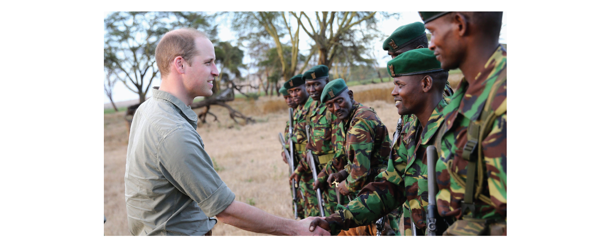

<ProjectHeading title='Taskforce Wildlife by United for Wildlife' abstract='Supporting companies in the transport sector in becoming more resilient to the exploitation of illegal wildlife traffickers' borderBottom huge />

<ProjectSection>
  <ProjectInfo title='Timeline' abstract='Launched Fall 2018' />
  <ProjectInfo title='Company' abstract='Edenspiekermann' />
  <ProjectInfo title='Role' abstract='I designed and iterated on core experiences within the application. I reported directly to the technical director of the product.' />
  <ProjectInfo title='About' abstract='Taskforce Wildlife is a tool that enables companies in the transport sector to assess their logistical decisions and confidently plan safe routes.' />
</ProjectSection>

## Context

Organized criminal networks across the globe have caused an unprecedented increase in the illegal hunting and trading of animals. Traffickers exploit unsuspecting transport businesses, such as passenger and cargo airlines and shipping companies, by using them to smuggle their contraband.

In response to the increase of illegal wildlife activities, United for Wildlife (UfW) approached my team at Edenspiekermann and asked us to explore approaches to lower the rate of wildlife trafficking. 

My teammates and I knew this scope of the problem was too large and complex. Instead, we looked for ways to pare it down to bite-sized pieces to establish an approachable problem space.

## Key insights from our research

While interviewing a representative from the logistics team from Bangkok Airways, we learned that decisions surrounding route planning are based on outdated reports or historic trends. Logisticians have no real time data to plan routes that they are sure aren’t compromised.

To understand the workflow of wildlife rangers appointed by UfW, we learned that rangers would make reports when they detect any suspicious activity. But these reports would often get buried in a dense backlog, rarely reaching transport businesses in time if at all.

## The breakthrough

At this point, it was clear to me that logistics plays a critical role in wildlife trafficking. The moments of friction I identified in the journey map (above) allowed me to show my team how we could tighten the problem space. Since we could not prevent wildlife trafficking from hijacking commercial vehicles, perhaps we could help transport businesses outsmart traffickers.

## Goals

- How can we establish communication between rangers and businesses and leverage the knowledge of rangers to improve route planning for businesses?
- How can we help businesses make the most of this information and use it towards planning safer routes?

## Taskforce Wildlife

Our final solution, Taskforce Wildlife, allowed logisticians to propose a route and would then output a bespoke risk report based on recent and historic reports made by rangers. The risk report creates a direct communication channel from rangers to logisticians. I created a user journey that helped the team and client understand how the observations of rangers in the field would directly be equipping logisticians with the information they need to plan safe routes.

## A design system to support our product

Unlike many products on the market today, we knew a wildlife product needed to work with specific real-world constraints. For this reason, we established two major guidelines.

### Guideline #1: Prompt action without fear-mongering

The tool needed to present critical information and a ton of it. However, we knew that jampacking the tool with terrifying warnings and complicated jargon would only overwhelm transport businesses. The design needed to strike a balance between approachable and actionable without downplaying the severity or urgency of the issue.

<iframe width="560" height="315" src="https://www.youtube.com/embed/Rs56Yv-ZqUY" width="600" height="400"></iframe>

_The design needed convey information in a manner that was approachable and actionable without downplaying the severity or urgency of what was at stake._

### Guideline #2: Provide accessibility

Rangers needed to be able to access Taskforce Wildlife while patrolling rural areas with limited technological access and send reports in real time. It needed to be lightweight, yet reliable. The design system needed to lean enough that loading time would not be compromised. I worked closely with the technical director to develop a library of responsive components fluid across all screen sizes and browser versions. We also opted for typography and high contrast visual treatments that would be communicative in smaller and older devices.

<iframe src="https://www.youtube.com/embed/B60NKcKKRiM" width="600" height="400"></iframe>

_We constructed a set of lightweight and responsive components so that rangers could load Taskforce Wildlife while patrolling rural areas with limited technological access._

### Impact

Taskforce Wildlife has since been released and used by rangers and logisticians regularly. United for Wildlife was very satisfied with how we approached the problem. This project was featured in a presentation led by the Duke of Cambridge at the 2018 Illegal Wildlife Trade Conference.
