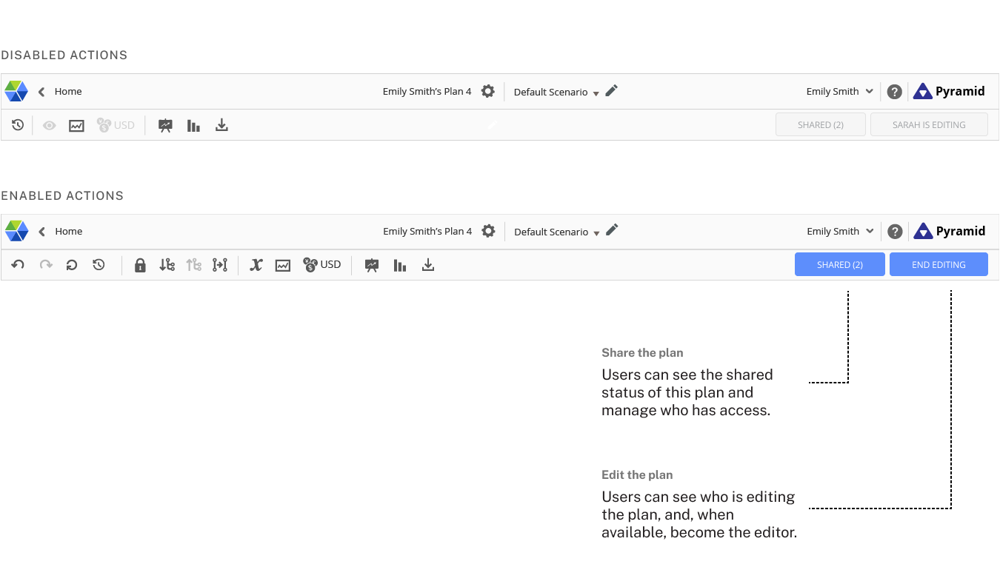
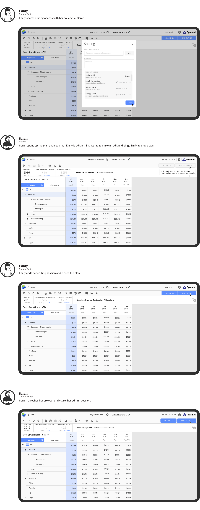

<ProjectHeading title='Workforce Planning by Visier' abstract='Facilitating collaboration for businesses to analyse their workforce' borderBottom huge />

<ProjectSection>
  <ProjectInfo title='Timeline' abstract='Launched Fall 2016' />
  <ProjectInfo title='Role' abstract='I designed and iterated on numerous features in the application while reporting directly to the design lead of the product. ' />
  <ProjectInfo title='Role' abstract='As a UX designer, I worked with developers, my product manager, and design lead to create a new feature that helps multiple users to edit the same plan. ' />
</ProjectSection>

## Context

Workforce Planning (WFP) is an application that allows users to plan and analyze their workforce supply and demand based on business needs and constraints. Generally, workforce planning is a collaborative effort between Finance and HR teams. To create the most effective workforce plans, organizations need a tool that can facilitate teamwork. 

## Problem

Unlike other spreadsheet tools on the market, a single edit generates changes to values across the grid that takes time to load. As a result, the feature was subject to these constraints:

1. Only one user can edit at a time.
2. The user must manually refresh the plan in order for the sharing status to take effect.

### Goals

Given our constraints, we couldn’t facilitate multiple users to edit the same workforce plan in real time. In the meantime, I aimed to create a design that accomplished the following:
- To help users identify who is editing a plan
- To help users transfer editing control
- To help users share permissions to a plan

After identifying these goals, I was able to find a jumping off point and create a mind map.

## Solution

### Designing the system

We needed a way to present the functionality to share, edit and identify the editor in a plan. I created two controls in the toolbar that would help users take sharing and editing actions as well as convey useful information about sharing and editing statues.

The controls a user can access is contingent on their permissions to the plan. To break down these complexities I created the following framework for all 4 possible cases.

### Final design

## Impact

After collaborating with the development team to ensure a successful handoff, the new feature was implemented into the build. During the month of release, the new functionality drove the user bases of each enterprise customer to increase by an average of 25%. Additionally, we received very favorable feedback from our reference customers. Given this success, my design lead and I advocated for this editing permission system to be used across our other services.

## The retrospective

Through the process of completing UX concepts and specifications for new features, I learned to be meticulous by questioning each moment in user interaction. Can I simplify this method by using fewer affordances? How can I make this new functionality using existing affordances that the user is familiar with? If I propose a new interface, is it worthwhile for the developers to program? During the start of the work term, I often failed to ask these questions. As a result, I had to make many more iterations of the mockups to achieve the completeness I would have had if I considered the previous questions.
