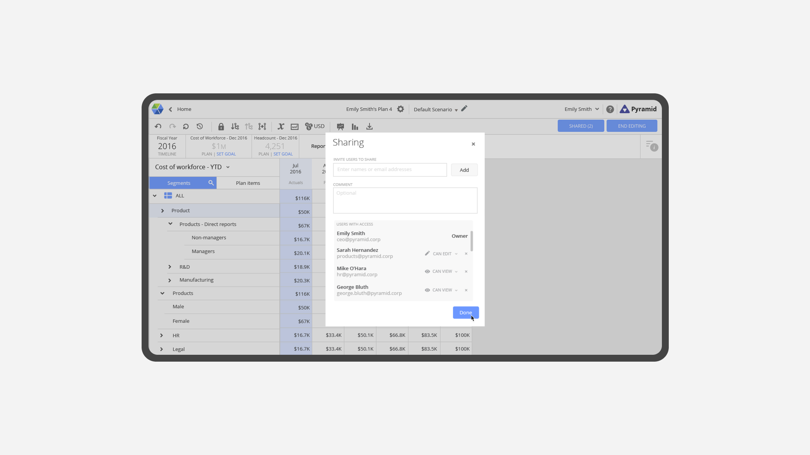
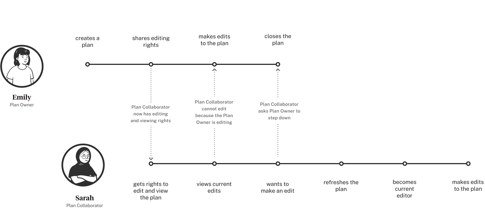

<ProjectHeading title='Workforce Planning by Visier' abstract='Facilitating collaboration for businesses to analyse their workforce' borderBottom huge />

<ProjectSection>
  <ProjectInfo title='Timeline' abstract='Launched Fall 2016' />
  <ProjectInfo title='Role' abstract='I designed and iterated on numerous features in the application while reporting directly to the design lead of the product. ' />
  <ProjectInfo title='Role' abstract='As a UX designer, I worked with developers, my product manager, and design lead to create a new feature that helps multiple users to edit the same plan. ' />
</ProjectSection>

## Context

Workforce Planning (WFP) is an application that allows users to plan and analyze their workforce supply and demand based on business needs and constraints. Generally, workforce planning is a collaborative effort between Finance and HR teams. To create the most effective workforce plans, organizations need a tool that can facilitate teamwork. However, WFP could not allow multiple users to edit simultaneously. 

## Problem

Unlike other spreadsheet tools on the market, a single edit generates changes to values across the grid that takes time to load. As a result, the feature was subject to these constraints:

1. Only one user can edit at a time.
2. The user must manually refresh the plan in order for the sharing status to take effect.

### Goals
**Long-term goal**: To facilitate multiple users to edit the same workforce plan

**Short-term goal**: 
- To help users identify who is editing a plan
- To help users transfer editing control
- To help users share permissions to a plan

After identifying these goals, I was able to find a jumping off point and create a mind map and another iteration of the interface sketch.

## Designing the system

We needed a way to present the functionality to share, edit and identify the editor in a plan. I created two controls in the toolbar that would help users take sharing and editing actions as well as convey useful information about sharing and editing statues.

The controls a user can access is contingent on their permissions to the plan. To break down these complexities I created the following framework for all 4 possible cases. 

## The design

This design was developed in the mockups below, and was implemented into the platform.

<iframe src="https://docs.google.com/presentation/d/e/2PACX-1vTNdm5y9S3qLCtrvRg8TTxw6qB4pxP4cHXqNrPzeoeSpUYj7bse12SzQ8e972rsV_UyHuJ7PL4a-prh/embed?start=true&loop=true&delayms=3000" frameborder="0" width="1440" height="839" allowfullscreen="true" mozallowfullscreen="true" webkitallowfullscreen="true"></iframe>

## The retrospective

Through the process of completing UX concepts and specifications for new features, I have learned the importance of finding the most feasible UX that supports the necessary functionality. To achieve this, I learned to be meticulous by questioning each moment in user interaction. Can I simply this method by using fewer affordances? How can I make this new functionality more accessible? Can I reuse an existing piece of UI or do I have to make a new one? If I propose a new interface, is it worthwhile for the developers to program? Can it reused? During the start of the work term, I often failed to ask these questions. As a result, I had to make many more iterations of the mockups to achieve the completeness I would have had if I considered the previous questions.

## Other Projects

### Data Management Tool

I worked with a Data Engineer intern to design and help implement (using HTML and LESS) an overhaul for an internal tool that helped reconfigure, validate and load incoming data into the Visier database. My contribution laid down the groundwork for the tool to continuously grow and assist Data Engineers in other aspects of their work.

### WFP Reintegration

Visier is currently in the process of integrating WFP into a new platform with other tools. By doing so, WFP will be more effective in sharing their plans, forecasts and budgets to the platform's business users. During the later months of my work term, I worked alongside the WFP PM and UX Lead to develop a comprehensive set of mockups which detailed end to end user work flows of the application.
